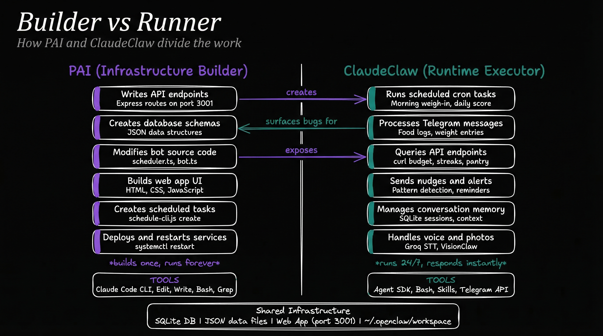

# ClaudeClaw Replication Guide

A recipe for deploying a personal AI assistant bot backed by the Claude Agent SDK with full PAI skill access.

## What This Is

ClaudeClaw is a Telegram bot that wraps Claude Code via the `@anthropic-ai/claude-agent-sdk`. Every message from the user gets routed through a full Claude Code session, meaning the bot has access to:

- All Claude Code tools (Bash, file system, web search, browser automation, MCP servers)
- All PAI skills from `~/.claude/skills/` (Research, Browser, Art, Fabric, etc.)
- Session continuity across messages (conversation resumption)
- A local SQLite memory system with full-text search
- Cron-based task scheduling
- Voice transcription (Groq Whisper)
- Photo, document, and video handling

## Architecture

```
Telegram User
     |
     v
Grammy Bot (bot.ts)
     |
     +-- Auth check (ALLOWED_CHAT_ID)
     +-- Media download (photos, voice, video, docs)
     +-- Voice transcription (Groq Whisper)
     |
     v
Agent (agent.ts)  <-- THE CORE
     |
     +-- @anthropic-ai/claude-agent-sdk query()
     +-- cwd: PROJECT_ROOT (loads CLAUDE.md)
     +-- resume: sessionId (conversation continuity)
     +-- permissionMode: bypassPermissions
     |
     v
Claude Code Session
     |
     +-- Reads CLAUDE.md from cwd (persona + instructions)
     +-- Reads ~/.claude/CLAUDE.md (global instructions)
     +-- Accesses ~/.claude/skills/* (all PAI skills)
     +-- Full tool access (Bash, Read, Write, WebSearch, etc.)
     |
     v
Response -> Markdown-to-HTML formatting -> Telegram
```

Supporting services:
- **SQLite** (better-sqlite3): Sessions, memories, scheduled tasks
- **Scheduler** (cron-parser): Polls every 60s, runs due tasks through the agent, with exponential backoff on failure (60s → 2min → 4min → ... → 30min cap)
- **Memory** (FTS5): Dual-sector (semantic/episodic) with salience decay

## Builder vs Runner: The Two-Role Architecture

ClaudeClaw operates as part of a two-role system. Understanding this split is essential for replication.



### PAI (Infrastructure Builder)

PAI runs in a Claude Code CLI session on the same machine. It builds and maintains ClaudeClaw's infrastructure:

- **Writes API endpoints** — Express routes on the web app (port 3001)
- **Creates database schemas** — JSON data structures, SQLite tables
- **Modifies bot source code** — scheduler.ts, bot.ts, new handlers
- **Builds web app UI** — HTML, CSS, JavaScript for dashboards
- **Creates scheduled tasks** — `schedule-cli.js create` for cron-based automation
- **Deploys and restarts services** — `systemctl restart`, build, test

**Tools:** Claude Code CLI, Edit, Write, Bash, Grep — full development toolchain.

### ClaudeClaw (Runtime Executor)

ClaudeClaw runs 24/7 as a systemd service, responding to messages and executing scheduled tasks:

- **Runs scheduled cron tasks** — Morning weigh-in prompts, daily scores, weekly digests
- **Processes Telegram messages** — Food logs, weight entries, questions
- **Queries API endpoints** — `curl` budget, streaks, pantry APIs that PAI built
- **Sends nudges and alerts** — Pattern detection, reminders, coaching
- **Manages conversation memory** — SQLite sessions, FTS5 context injection
- **Handles voice and photos** — Groq STT transcription, VisionClaw food detection

**Tools:** Agent SDK, Bash, PAI Skills, Telegram API — runtime execution.

### Shared Infrastructure

Both roles read/write the same underlying data:
- SQLite database (sessions, memories, scheduled tasks)
- JSON data files (meal-log.json, weight-data.json, goals.json, etc.)
- Web app on port 3001 (API endpoints + UI)
- `~/.openclaw/workspace/` (grocery system, meal tools)

### How to Replicate This Pattern

To set up the same builder/runner split in another PAI installation:

**1. Set up ClaudeClaw (the Runner)**

Follow the Quick Start Checklist below to deploy the bot. This gives you the runtime executor — it handles messages, runs cron tasks, and manages memory.

**2. Build infrastructure from PAI (the Builder)**

From a Claude Code CLI session on the same machine:

```bash
# Add a web app endpoint
# Edit the server.js, restart the service
claude  # then ask: "add a /api/budget endpoint to the web app"

# Create a scheduled task
node /path/to/ClaudeClaw/dist/src/schedule-cli.js create \
  YOUR_CHAT_ID "0 13 * * *" "Your daily prompt here"

# Modify bot behavior
# Edit CLAUDE.md to change persona, add domain knowledge, register new skills
```

**3. Key principles**

- **PAI builds once, ClaudeClaw runs forever.** Infrastructure changes are infrequent. Runtime execution is continuous.
- **ClaudeClaw should never modify its own source code.** It queries APIs, runs prompts, sends messages. If it needs new capabilities, PAI builds them.
- **Scheduled tasks are the bridge.** PAI creates cron tasks via `schedule-cli.js`. ClaudeClaw executes them on schedule. This is how features like daily scores and weekly digests work without code changes.
- **The web app is the shared API layer.** PAI adds endpoints (budget, streaks, etc.). ClaudeClaw's scheduled tasks `curl` those endpoints to gather data for reports.
- **Exponential backoff on scheduler failures is non-negotiable.** Without it, a failing task retries every 60s indefinitely. See scheduler.ts for the implementation: `min(60s * 2^failures, 30min)`, reset on success.

## The Core Pattern: Agent SDK + CWD + CLAUDE.md

This is the key design insight. The entire system reduces to one function:

```typescript
import { query } from '@anthropic-ai/claude-agent-sdk';

const events = query({
  prompt: message,
  options: {
    // THIS is what gives access to PAI skills and persona
    cwd: '/path/to/your/project',

    // Resume an existing conversation (session continuity)
    ...(sessionId ? { resume: sessionId } : {}),

    // Load project-level and user-level CLAUDE.md files
    settingSources: ['project', 'user'],

    // Run without permission prompts (headless)
    permissionMode: 'bypassPermissions',
    allowDangerouslySkipPermissions: true,
  },
});

// Stream events
for await (const event of events) {
  if (event.type === 'system' && event.subtype === 'init') {
    // Capture session_id for resumption
    sessionId = event.session_id;
  }
  if (event.type === 'result' && event.subtype === 'success') {
    resultText = event.result;
  }
}
```

**Why `cwd` matters:** Claude Code loads `CLAUDE.md` from the working directory. By setting `cwd` to your project root, you control:
1. The bot's persona and personality
2. What instructions it follows
3. What tools/scripts it knows about

**Why `settingSources` matters:** `['project', 'user']` means it loads both:
- The project-level `CLAUDE.md` in your `cwd` (persona, specific instructions)
- The user-level `~/.claude/CLAUDE.md` (global PAI skills, system-wide config)

**Why `permissionMode: 'bypassPermissions'` matters:** The bot runs headless with no human to click "approve". This lets it use all tools without prompts.

## Source Files

| File | Purpose |
|------|---------|
| `src/index.ts` | Entry point. PID lock, database init, memory decay, bot startup |
| `src/agent.ts` | Agent SDK wrapper. The `runAgent()` function (shown above) |
| `src/bot.ts` | Grammy bot. Commands, message routing, Telegram HTML formatting |
| `src/config.ts` | Configuration from `.env`. Exports all config constants |
| `src/env.ts` | `.env` file parser (no process.env pollution) |
| `src/db.ts` | SQLite schema + CRUD. Sessions, memories, scheduled tasks |
| `src/memory.ts` | Memory context injection. FTS5 search + recency retrieval |
| `src/voice.ts` | Groq Whisper transcription for voice notes |
| `src/media.ts` | Telegram file download, media prompt builders, upload cleanup |
| `src/scheduler.ts` | Cron-based task runner. Polls every 60s |
| `src/logger.ts` | Pino logger (JSON in prod, pretty in dev) |
| `scripts/setup.ts` | Interactive setup wizard (env, CLAUDE.md, systemd) |

## Dependencies

```json
{
  "@anthropic-ai/claude-agent-sdk": "latest",
  "grammy": "^1.30.0",
  "better-sqlite3": "^11.0.0",
  "pino": "^9.0.0",
  "pino-pretty": "^11.0.0",
  "cron-parser": "^4.9.0"
}
```

Dev dependencies: `typescript`, `tsx`, `@types/better-sqlite3`, `@types/node`, `vitest`

Requires: **Node.js >= 20**, **Claude CLI installed and authenticated**

## Environment Variables

Create a `.env` file in the project root:

```bash
# --- Required -----------------------------------------------
TELEGRAM_BOT_TOKEN=         # From @BotFather on Telegram
ALLOWED_CHAT_ID=            # Comma-separated chat IDs (send /chatid to bot to discover)

# --- Voice (STT) --------------------------------------------
GROQ_API_KEY=               # Free at console.groq.com -- for voice note transcription

# --- Video Analysis ------------------------------------------
GOOGLE_API_KEY=             # Free at aistudio.google.com -- for video analysis via Gemini

# --- Optional ------------------------------------------------
LOG_LEVEL=info              # debug | info | warn | error
NODE_ENV=production         # development for pretty logs
```

The `.env` is parsed by `src/env.ts` directly (no dotenv dependency, no process.env pollution).

## Session Resumption

Conversation continuity works through Claude Code's built-in session system:

1. First message from a chat: `runAgent(prompt)` with no `sessionId`
2. Agent returns `event.session_id` from the `init` event
3. Session ID is stored in SQLite: `sessions(chat_id, session_id, updated_at)`
4. Next message: `runAgent(prompt, savedSessionId)` passes `resume: sessionId`
5. Claude Code resumes the conversation with full context

Users can reset with `/newchat` or `/forget`, which deletes the session row.

## Memory System

A supplementary memory layer on top of Claude Code's own session resumption:

**Two sectors:**
- **Semantic**: Long-term facts (triggered by "my", "I am", "I prefer", "remember", "always", "never")
- **Episodic**: Conversation history (everything else over 20 chars)

**How it works:**
1. Each user message is saved as a memory row with `salience = 1.0`
2. Before each agent call, `buildMemoryContext()` retrieves:
   - Top 3 FTS5 matches against the current message
   - Top 5 most recently accessed memories
3. Matched memories get a salience boost (+0.1, capped at 5.0)
4. Daily decay sweep: all memories older than 24h get `salience *= 0.98`
5. Memories with `salience < 0.1` are deleted
6. Memories older than 30 days with `salience < 0.3` are deleted

**Schema:**
```sql
CREATE TABLE memories (
  id          INTEGER PRIMARY KEY AUTOINCREMENT,
  chat_id     TEXT NOT NULL,
  content     TEXT NOT NULL,
  sector      TEXT NOT NULL CHECK(sector IN ('semantic','episodic')),
  salience    REAL NOT NULL DEFAULT 1.0,
  created_at  INTEGER NOT NULL,
  accessed_at INTEGER NOT NULL
);

CREATE VIRTUAL TABLE memories_fts USING fts5(content, content_rowid='id');
```

## Scheduled Tasks

Users can schedule recurring tasks via `/schedule create <cron> <prompt>`:

- Tasks stored in SQLite with cron expression and next_run timestamp
- Scheduler polls every 60s, runs due tasks through `runAgent()`
- Results sent back to the originating chat
- Supports pause/resume/delete

## Media Handling

The bot handles photos, documents, voice notes, and video:

1. **Download**: Telegram `file_id` -> Telegram API `getFile` -> download bytes -> save to `workspace/uploads/`
2. **Prompt injection**: Each media type gets a context prompt telling Claude what was received and where to find it
3. **Cleanup**: Uploads older than 24h are deleted every 6 hours

Voice notes specifically go through Groq Whisper transcription before being processed as text.

## CLAUDE.md Customization

The `CLAUDE.md` in your project root is the persona and instruction file. This is what you customize per deployment. Key sections:

```markdown
# Bot Name

You are [name]'s personal AI assistant, accessible via Telegram.
You run as a persistent service on [machine description].

## Personality
[Define voice, tone, rules -- no em dashes, no sycophancy, etc.]

## Who Is [Owner]
[Context about the user for personalized responses]

## Your Environment
- All global Claude Code skills (~/.claude/skills/) are available
- Tools: Bash, file system, web search, browser automation, all MCP servers
- This project lives at [project path]

## Available Skills (PAI)
[List key skills and their triggers]

## [Domain-Specific Sections]
[Grocery system, meal logging, inventory -- whatever your bot manages]

## Message Format
- Keep responses tight and readable on a phone screen
- Use plain text over heavy markdown
- For long outputs: summary first, offer to expand

## Rules
- Be concise. Most responses should be 1-3 sentences for simple questions.
- Never expose file paths, API keys, or credentials in responses.
```

**The critical line** is `settingSources: ['project', 'user']` in the agent call. This loads both:
- Your project CLAUDE.md (persona, domain knowledge)
- `~/.claude/CLAUDE.md` (PAI system, global skills)

## Deployment

### Build

```bash
npm install
npm run build    # tsc -> dist/
```

### Run Manually

```bash
npm run dev      # tsx (development, pretty logs)
npm start        # node dist/ (production)
```

### Systemd Service (Recommended)

Create `~/.config/systemd/user/claudeclaw.service`:

```ini
[Unit]
Description=ClaudeClaw - Telegram bot via Claude Agent SDK
After=network-online.target
Wants=network-online.target

[Service]
Type=simple
ExecStart=/usr/bin/node /path/to/ClaudeClaw/dist/src/index.js
WorkingDirectory=/path/to/ClaudeClaw
Restart=always
RestartSec=10
Environment=HOME=/home/youruser
Environment=PATH=/home/youruser/.local/bin:/home/youruser/.bun/bin:/usr/local/bin:/usr/bin:/bin
StandardOutput=journal
StandardError=journal

[Install]
WantedBy=default.target
```

Then:

```bash
systemctl --user daemon-reload
systemctl --user enable claudeclaw.service
systemctl --user start claudeclaw.service

# Check status
systemctl --user status claudeclaw
journalctl --user -u claudeclaw -f
```

### Setup Wizard

The interactive setup wizard handles all of this:

```bash
npm run setup    # Prompts for tokens, writes .env, opens CLAUDE.md, installs systemd
```

## Quick Start Checklist

1. Clone/copy the project to a new machine
2. Run `npm install`
3. Create a Telegram bot via @BotFather, get the token
4. Run `npm run setup` (or manually create `.env`)
5. Edit `CLAUDE.md` to customize persona and instructions
6. Ensure Claude CLI is installed and authenticated (`claude --version`)
7. Ensure `~/.claude/skills/` contains your PAI skills (or whatever skills you want)
8. `npm run build`
9. `systemctl --user enable --now claudeclaw.service`
10. Send `/chatid` to the bot on Telegram
11. Add the chat ID to `ALLOWED_CHAT_ID` in `.env` and restart

## Adapting for Other Platforms

The architecture is platform-agnostic at the agent layer. To adapt for a different messaging platform:

1. Replace `grammy` with your platform's SDK (Discord.js, Slack Bolt, etc.)
2. Keep `agent.ts` unchanged -- it's the universal bridge
3. Adapt `bot.ts` message handlers for your platform's message format
4. Adapt `formatForTelegram()` for your platform's markup (Discord uses Markdown, Slack uses mrkdwn)
5. Adapt media download for your platform's file handling API
6. Keep `db.ts`, `memory.ts`, `scheduler.ts` unchanged -- they're platform-independent

The core value is in `agent.ts` + `CLAUDE.md` + session resumption. Everything else is platform glue.

## Troubleshooting

Common pitfalls and how to diagnose them.

### Bot Receives Messages But Doesn't Reply

**Symptom:** Telegram shows the message was delivered but no response comes back.

**Diagnosis:**
1. Check the service is running: `systemctl --user status claudeclaw`
2. Check logs for errors: `journalctl --user -u claudeclaw -n 50`
3. Verify `ALLOWED_CHAT_ID` matches your chat: send `/chatid` to the bot
4. Check Claude CLI is authenticated: `claude --version` (if it prompts for login, auth has expired)

**Common causes:**
- Claude API rate limit hit — check logs for 429 errors. Wait and retry.
- Session ID corrupted — run `/newchat` to start fresh session.
- Anthropic API key expired or invalid — check `.env` file.

### Voice Messages Not Transcribed

**Symptom:** Voice messages arrive but get `[Voice transcription failed]` response.

**Diagnosis:**
1. Check `GROQ_API_KEY` is set in `.env`
2. Test Groq API manually: `curl -s https://api.groq.com/openai/v1/models -H "Authorization: Bearer $GROQ_API_KEY"`
3. Check file format — Telegram sends `.oga`, the bot renames to `.ogg` for Whisper

**Common causes:**
- Groq API key not set or expired
- Groq rate limit (free tier: 20 requests/minute)
- Temp file cleanup happening too fast — check `/tmp/` for orphaned audio files

### Memory Not Persisting Across Restarts

**Symptom:** Bot forgets everything after service restart.

**Diagnosis:**
1. Check SQLite database exists: `ls -la data/claudeclaw.db` (or wherever `DB_PATH` points)
2. Verify session resumption: check logs for `Resuming session:` entries
3. Test FTS5: `sqlite3 data/claudeclaw.db "SELECT * FROM memories ORDER BY created_at DESC LIMIT 5;"`

**Common causes:**
- Database file in a temp directory that gets cleaned
- Session ID not being stored/retrieved from the sessions table
- Memory salience decayed below threshold (0.1) — all old memories auto-deleted

### Scheduled Tasks Not Firing

**Symptom:** Cron tasks defined but never execute.

**Diagnosis:**
1. List active tasks: `node dist/schedule-cli.js list`
2. Check scheduler is running — look for `Scheduler tick` in logs
3. Verify cron expression: use [crontab.guru](https://crontab.guru) to validate
4. Check if the task is paused: `sqlite3 data/claudeclaw.db "SELECT * FROM scheduled_tasks WHERE status='active';"`

**Common causes:**
- Scheduler poll interval (60s) means tasks can be delayed up to 1 minute
- Exponential backoff after failure — task may be in cooldown (check `next_run_at`)
- Task assigned to wrong `chat_id` — verify the chat ID matches your Telegram chat

### Agent SDK Query Hangs

**Symptom:** Message sent but the agent never returns a response. No error, just silence.

**Diagnosis:**
1. Check if a Claude process is running: `ps aux | grep claude`
2. Look for zombie sessions: the Agent SDK spawns a `claude` subprocess that may hang
3. Check PID lock: if `claudeclaw.pid` exists with a dead PID, the service won't start a new instance

**Common causes:**
- Claude CLI update changed the binary path
- System out of memory (check `free -h`) — Claude processes are memory-hungry
- Network issue to Anthropic API — check `curl -s https://api.anthropic.com/v1/messages`

### WhatsApp Bridge Issues

**Symptom:** WhatsApp messages not being captured or sent.

**Diagnosis:**
1. Check if Puppeteer/Chrome is running: `ps aux | grep chrome`
2. QR code may need re-scanning — check logs for `qr` event
3. Verify `whatsapp-web.js` session data exists in `.wwebjs_auth/`

**Common causes:**
- WhatsApp Web session expired (re-scan QR code)
- Puppeteer can't find Chrome — set `PUPPETEER_EXECUTABLE_PATH` in `.env`
- On headless servers: need `--no-sandbox` flag for Chromium

### Duplicate Bot Instances

**Symptom:** Bot sends multiple responses to the same message, or messages go missing.

**Diagnosis:**
1. Check for multiple processes: `pgrep -f claudeclaw`
2. Check PID lock file: `cat claudeclaw.pid`
3. If both systemd and a manual `npm start` are running, one will steal Telegram poll updates

**Fix:** Kill all instances, then start only via systemd: `systemctl --user restart claudeclaw`

### Environment Variable Not Loading

**Symptom:** A feature doesn't work even though the key is in `.env`.

**Diagnosis:**
1. Verify `.env` is in the project root (same directory as `package.json`)
2. Check for special characters in values — wrap in double quotes if needed
3. Verify the key name matches exactly (case-sensitive)
4. After changing `.env`, restart the service: `systemctl --user restart claudeclaw`

**Common causes:**
- `.env` file has trailing whitespace on the key line
- Value contains `#` which is interpreted as a comment — wrap in quotes
- Key name has a typo (e.g., `GROQ_API_KEY` vs `GROK_API_KEY`)
